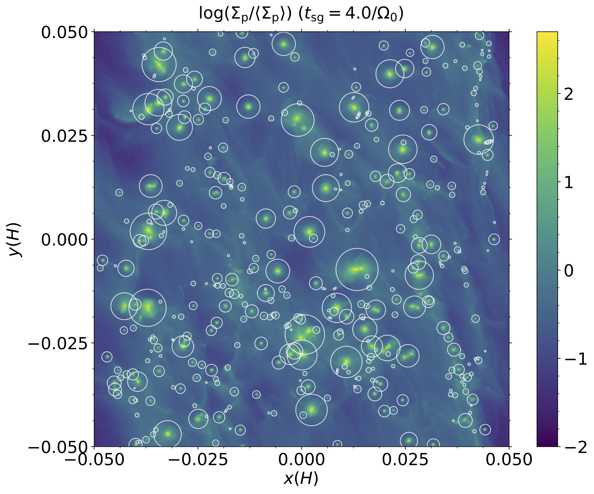

# PLAN
[](https://doi.org/10.5281/zenodo.1436807)

PLanetesimal ANalyzer (`PLAN`, Li et al. in prep) is designed to identify and further characterize the properties of planetesimals produced in the numerical simulations of the Streaming Instability ([Youdin & Goodman 2005](https://doi.org/10.1086/426895)) and dust self-gravity with code [`ATHENA`](https://github.com/PrincetonUniversity/Athena-Cversion) ([Stone et al. 2008](https://doi.org/10.1086/588755), [Bai & Stone 2010](https://doi.org/10.1088/0067-0049/190/2/297), [Simon et al. 2016](https://doi.org/10.3847/0004-637X/822/1/55)).  `PLAN`  has already been used in the analyses of [Li et al. (2018)](https://doi.org/10.3847/1538-4357/aaca99), [Abod et al. (2018)](https://doi.org/10.3847/1538-4357/aaca99), and Nesvorný et al. (just accepted by Nature Astronomy). 

Currently, `PLAN` works with the 3D particle output of Athena and find gravitationally bound clumps robustly and efficiently.  `PLAN`, which is written in `C++` with `OpenMP/MPI`, is massively parallelized to analyze billions of particles and many snapshots simultaneously.  `PLAN` may be also used to analyze the grid data (VTK dumps of primitive variables in grids), which is supported by its VTK module (utilizing Boost MultiDimensional Array Library).

## Demo

The picture below is a snapshot of the solid surface density from one of our high-resolution shearing box simulations. Self-bound clumps have already formed from collapse in this snapshot. All of the clumps identified by PLAN are marked by white circles that illustrate their Hill spheres.



## Compile & Run
CMake is needed to generate a Makefile and compile this program. Boost headers are also required. `PLAN` can be accelerated with `MPI` and `OpenMP`.

You may just run `cmake` and `make` to build `PLAN`.

```shell
➜  PLAN $ ls
CMakeLists.txt README.md      src
➜  PLAN $ mkdir build && cd ./build
➜  build $ cmake ..
-- The C compiler identification is AppleClang 9.0.0.9000039
-- The CXX compiler identification is AppleClang 9.0.0.9000039
-- Check for working C compiler: /Applications/Xcode.app/Contents/Developer/Toolchains/XcodeDefault.xctoolchain/usr/bin/cc
-- Check for working C compiler: /Applications/Xcode.app/Contents/Developer/Toolchains/XcodeDefault.xctoolchain/usr/bin/cc -- works
-- Detecting C compiler ABI info
-- Detecting C compiler ABI info - done
-- Detecting C compile features
-- Detecting C compile features - done
-- Check for working CXX compiler: /Applications/Xcode.app/Contents/Developer/Toolchains/XcodeDefault.xctoolchain/usr/bin/c++
-- Check for working CXX compiler: /Applications/Xcode.app/Contents/Developer/Toolchains/XcodeDefault.xctoolchain/usr/bin/c++ -- works
-- Detecting CXX compiler ABI info
-- Detecting CXX compiler ABI info - done
-- Detecting CXX compile features
-- Detecting CXX compile features - done
============================================================
Run cmake without any option will build a serial program.
The availabel build options are:
    -DPARALLEL=ON   to enable MPI
    -DOPENMP=ON     to enable OpenMP
    -DHYBRID=ON     to enable MPI+OpenMP
N.B.: the chosen option is cached after the first use.
To switch, add -DOPTION=OFF to turn off the previous choice.
eg. cmake -DHYBRID=OFF -DOPENMP=ON ../
You can always delete cache files/folders for a fresh start.
PS: clang/gcc built-in with macOS does not support OpenMP.
============================================================
============================================================
Now, generating Makefile for serial program...
============================================================
-- Boost version: 1.66.0
-- Configuring done
-- Generating done
-- Build files have been written to: /Users/rixin/PLAN/build
➜  build $ make -j 4
Scanning dependencies of target plan
[ 60%] Building CXX object CMakeFiles/plan.dir/src/global.cpp.o
[ 60%] Building CXX object CMakeFiles/plan.dir/src/analyses.cpp.o
[ 60%] Building CXX object CMakeFiles/plan.dir/src/tree.cpp.o
[ 80%] Building CXX object CMakeFiles/plan.dir/src/main.cpp.o
[100%] Linking CXX executable plan
[100%] Built target plan
➜  build $ ls
CMakeCache.txt      CMakeFiles          Makefile            cmake_install.cmake plan
```

You can specify the environment variables `CC` and `CXX` to tell cmake which compilers to use. In addition, three options are available to build `PLAN` with MPI and/or OpenMP.

```shell
➜  build $ rm -rf ./*
zsh: sure you want to delete all 5 files in /Users/rixin/PLAN/build/. [yn]? y
➜  build $ export CC=gcc; export CXX=g++
➜  build $ cmake -DHYBRID=ON ..
-- The C compiler identification is GNU 7.3.0
-- The CXX compiler identification is GNU 7.3.0
-- Checking whether C compiler has -isysroot
-- Checking whether C compiler has -isysroot - yes
-- Checking whether C compiler supports OSX deployment target flag
-- Checking whether C compiler supports OSX deployment target flag - yes
-- Check for working C compiler: /opt/local/bin/gcc
-- Check for working C compiler: /opt/local/bin/gcc -- works
-- Detecting C compiler ABI info
-- Detecting C compiler ABI info - done
-- Detecting C compile features
-- Detecting C compile features - done
-- Checking whether CXX compiler has -isysroot
-- Checking whether CXX compiler has -isysroot - yes
-- Checking whether CXX compiler supports OSX deployment target flag
-- Checking whether CXX compiler supports OSX deployment target flag - yes
-- Check for working CXX compiler: /opt/local/bin/g++
-- Check for working CXX compiler: /opt/local/bin/g++ -- works
-- Detecting CXX compiler ABI info
-- Detecting CXX compiler ABI info - done
-- Detecting CXX compile features
-- Detecting CXX compile features - done
============================================================
Run cmake without any option will build a serial program.
The availabel build options are:
    -DPARALLEL=ON   to enable MPI
    -DOPENMP=ON     to enable OpenMP
    -DHYBRID=ON     to enable MPI+OpenMP
N.B.: the chosen option is cached after the first use.
To switch, add -DOPTION=OFF to turn off the previous choice.
eg. cmake -DHYBRID=OFF -DOPENMP=ON ../
You can always delete cache files/folders for a fresh start.
PS: clang/gcc built-in with macOS does not support OpenMP.
============================================================
============================================================
Now, generating Makefile for hybrid program (MPI+OpenMP)
============================================================
-- Found MPI_C: /opt/local/lib/mpich-gcc7/libmpi.dylib (found version "3.1")
-- Found MPI_CXX: /opt/local/lib/mpich-gcc7/libmpicxx.dylib (found version "3.1")
-- Found MPI: TRUE (found version "3.1")
-- Found OpenMP_C: -fopenmp (found version "4.5")
-- Found OpenMP_CXX: -fopenmp (found version "4.5")
-- Found OpenMP: TRUE (found version "4.5")
-- Boost version: 1.66.0
-- Configuring done
-- Generating done
-- Build files have been written to: /Users/rixin/PLAN/build
➜  build $ make -j 4
Scanning dependencies of target plan
[ 60%] Building CXX object CMakeFiles/plan.dir/src/analyses.cpp.o
[ 60%] Building CXX object CMakeFiles/plan.dir/src/global.cpp.o
[ 60%] Building CXX object CMakeFiles/plan.dir/src/tree.cpp.o
[ 80%] Building CXX object CMakeFiles/plan.dir/src/main.cpp.o
[100%] Linking CXX executable plan
[100%] Built target plan
➜  build $ ls
CMakeCache.txt      CMakeFiles          Makefile            cmake_install.cmake plan
```

To clean CMake results and cache, just delete the `build` directory or its contents.

Below shows a test run.

```shell
➜  build $ ./plan
Program begins now (local time: Mon Mar 26 02:29:20 2018).
*******************************************************************************
USAGE:
./plan -c <num_cpus> -i <data_dir> -b <basename> -p <postname>  -f <range(f1:f2)|range_step(f1:f2:step)> -o <output> [-t <input_file_for_constants> --flags]
Example: ./plan -c 64 -i ./bin/ -b Par_Strat3d -p ds -f 170:227 -o result.txt -t plan_input.txt --Verbose --Find_Clumps
[...] means optional arguments. Available flags:
Use --Help to obtain this usage information
Use --Verbose to obtain more output during execution
Use --Debug to obtain all possible output during execution
Use --Combined to deal with combined lis files (from all processors)
Use --Find_Clumps to run clump finding functions
Use --Basic_Analyses to perform basic analyses, which will output max($\rho_p$) and $H_p$
Use --Density_Vs_Scale to calculate max($\rho_p$) as a function of length scales
Use --Temp_Calculation to do temporary calculations in TempCalculation()
If you do not specify any flags, then --Find_Clumps will be turned on automatically.
➜  build $ mpirun -np 2 ./plan -c 64 -i ../data/ -b Par_Strat3d -p combined -f 214:215:1 -o ./result.txt
Program begins now (local time: Mon Mar 26 02:18:10 2018).
*******************************************************************************
Set the number of available threads for OpenMP to 8. This number can also be fixed manually by specifying "num_threads" in the parameter input file.
Note that every processor in MPI will utilize such number of threads in its own node. It is recommendeded to use --map-by ppr:n:node in the Hybrid scheme.
For example, to obtain the best performance, if there are 16 cores per node, then
	mpirun -np XX --map-by ppr:2:node:pe=8 ./your_program ...
with num_threads=8 will initialize 2 processors in each node and each processor will utilize 8 threads in the OpenMP sections. In this way, the entire node is fully utilized.
Processor 0: Finish clump finding for t = 215.001, found 12 clumps;  Mp_max = 0.000331565, Mp_tot = 0.00113912(56.805420%) in code units.
Processor 1: Finish clump finding for t = 214.001, found 12 clumps;  Mp_max = 0.000367304, Mp_tot = 0.00115491(57.592773%) in code units.
Max waiting time among all processors due to Barrier(): 8.5939e-05s.
*******************************************************************************
Program ends now (local time: Mon Mar 26 02:18:10 2018). Elapsed time: 1.880250e-01 seconds.
```


